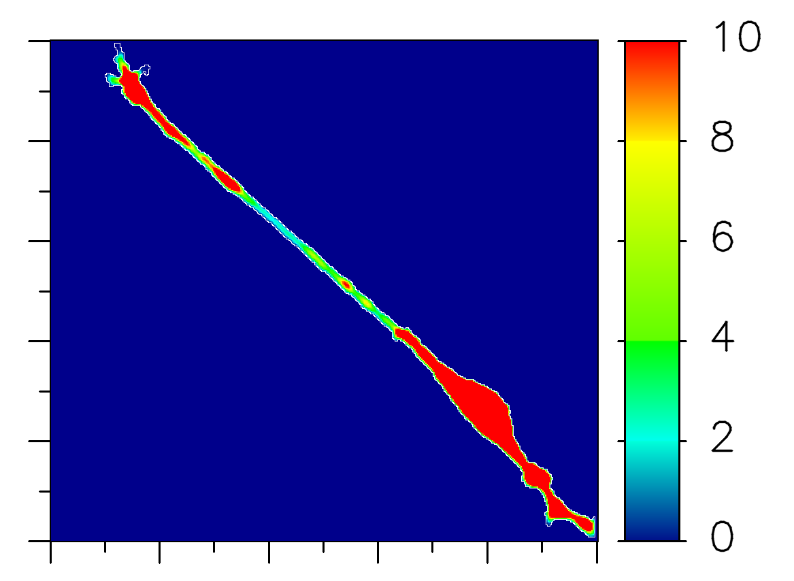

# Dockerfile and script to run [spatialsimulator](https://github.com/spatialsimulator) on docker.
Dockerfile and a shell script in this repository will help you execute [SpatialSimulator](https://github.com/spatialsimulator) (for Linux 64bit) on docker.



## How to use
### Requirements
Docker, of course :-)
I have tested this script with [Docker for Mac](https://www.docker.com/products/docker#/mac) on MacOS Sierra.

### Download and setup
#### Clone this project
```sh
cd ~/git/
git clone https://github.com/funasoul/docker-spatialsim.git
cd ~/git/docker-spatialsim/
```

#### How to use
Usage and accepted options will be shown by the following command.
```sh
./docker-spatialsim.sh
===== docker-spatialsim.sh      Run spatialsimulator on docker ===================
Usage          : docker-spatialsim.sh [option] filename(SBML file only)
 -h            : show this message
 -x #(int)     : the number of points at x coordinate (for analytic geometry only)
                 (ex. -x 200 [default:100])
 -y #(int)     : the number of points at y coordinate (for analytic geometry only)
                 (ex. -y 200 [default:100])
 -z #(int)     : the number of points at z coordinate (for analytic geometry only)
                 (ex. -z 200 [default:100])
 -t #(double)  : simulation time (ex. -t 10 [default:1.0])
 -d #(double)  : delta t (ex. -d 0.1 [default:0.01])
 -o #(int)     : output results every # steps (ex. -o 10 [default:1])
 -c #(double)  : min of color bar range (ex. -c 1 [default:0.0])
 -C #(double)  : max of color bar range (ex. -C 10)
                 [default:Max value of InitialConcentration or InitialAmount]
 -s char#(int) : {x,y,z} and the number of slice (only 3D) (ex. -s z10)
 -O outDir     : path to output directory

(ex)           : docker-spatialsim.sh -t 0.1 -d 0.001 -o 10 -C 10 sam2d.xml
```

### Launch SpatialSimulator on docker
```sh
./docker-spatialsim.sh -t 0.1 -d 0.001 -o 10 sam2d.xml
```
Simulation result will be stored under `result/` directory. Of course, you can specify the output directory with `-O output_dir` option.
Have fun!
